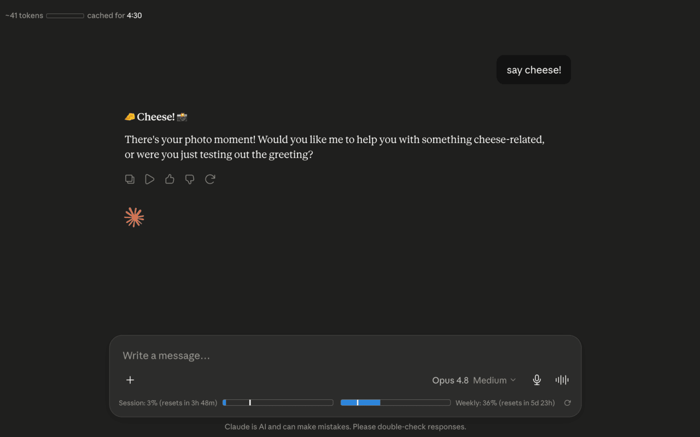

# Claude Token Counter

A minimal browser extension that shows token count, cache timer, and usage bars on claude.ai.

## Features

- **Token count** — Approximate token count for the current conversation, with a mini progress bar against the 200k context limit
- **Cache timer** — Countdown showing how long the conversation remains cached (cheaper to continue)
- **Usage bars** — Session (5-hour) and weekly (7-day) usage from Claude's native API, with progress bars and reset countdowns (more accurate than the rounded /usage page)

## Installation

Available directly from the Chrome Web Store:

1. Visit the **Claude Token Counter** extension page (link to be added once published).
2. Click **Add to Chrome**.

## How it works

- Intercepts Claude's API responses to read conversation data and usage info
- Uses a vendored tokenizer (`o200k_base`) for approximate token counting
- Uses Claude’s `/usage` plus live SSE `message_limit` data; the SSE provides exact, unrounded utilization fractions, so the progress bars are more accurate than the rounded percentages shown on Claude’s native /usage page
- Watches for DOM changes to inject UI elements as you navigate

## Privacy

- All data stays local — no external servers, no tracking
- Reads your `lastActiveOrg` cookie to query Claude's `/usage` endpoint
- Makes requests only to `claude.ai`

## Credits

- Token counting via [gpt-tokenizer](https://github.com/niieani/gpt-tokenizer) (MIT)
- Inspired by [Claude Usage Tracker](https://github.com/lugia19/Claude-Usage-Extension) by lugia19

## License

MIT
